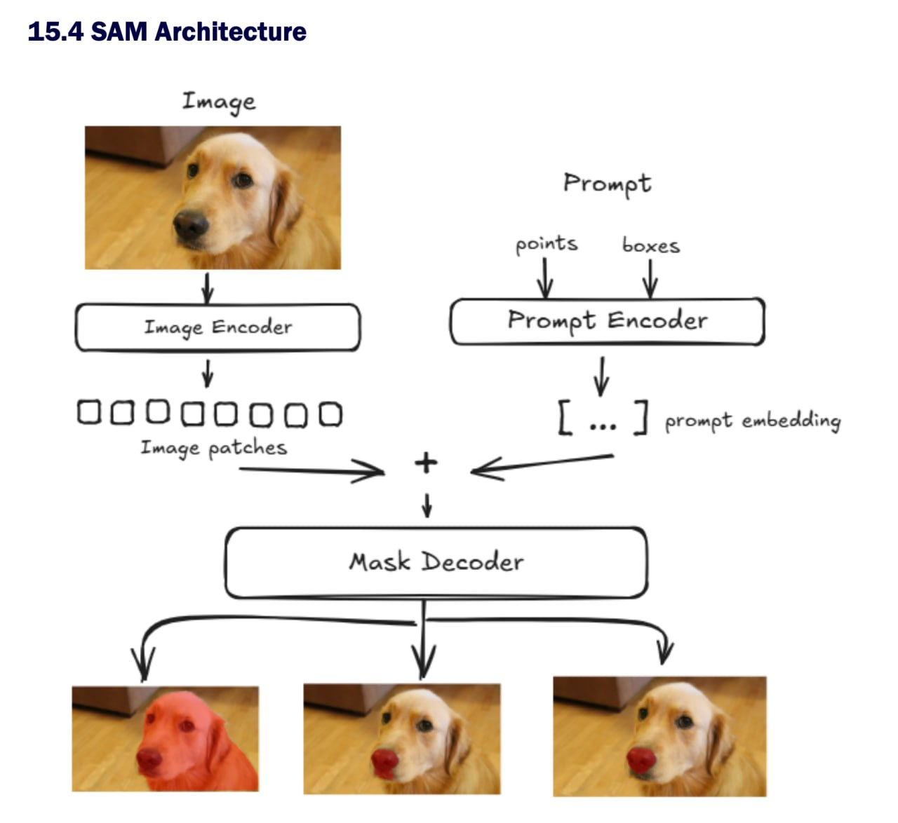

SAM (Segment Anything Model, Meta AI, 2023) has an elegant design philosophy that is worth understanding deeply.

The key design decision is that SAM separates expensive image processing from lightweight prompt processing:

```text
Image Encoder  → HEAVY (run ONCE per image, ~600 ms on GPU)
Prompt Encoder → LIGHT (run on every click/box, ~few ms)
Mask Decoder   → LIGHT (run on every click/box, ~few ms)
```

This split is what makes SAM feel interactive. You upload an image once, then you can click 50 different points and get 50 segmentations almost instantly, because the expensive image processing is cached. Keep this in mind as we look at each piece.

## 1. Image Encoder

The Image Encoder is a Vision Transformer (ViT), pre-trained using a self-supervised method called MAE (Masked Autoencoder). In the original paper, the strongest variant is ViT-H/16.

Conceptually, it transforms a raw image, just pixels, into a rich grid of feature vectors that capture "what's where" semantically.

{#fig-sam-architecture width="100%"}

### What happens step by step

```text
┌──────────────────────────────────────────────────────────┐
│ Input image: 1024 × 1024 × 3 (RGB)                       │
└──────────────────────────────────────────────────────────┘
                           │
                           ▼
        (1) Patchify: cut into 16×16 patches
┌──────────────────────────────────────────────────────────┐
│ 64 × 64 = 4,096 patches                                  │
│ Each patch: 16×16×3 = 768 raw numbers                    │
└──────────────────────────────────────────────────────────┘
                           │
                           ▼
        (2) Linear projection → patch embeddings
┌──────────────────────────────────────────────────────────┐
│ 4,096 tokens, each a vector of dim 1280 (ViT-H)          │
│ + add positional embeddings, so model knows order        │
└──────────────────────────────────────────────────────────┘
                           │
                           ▼
        (3) Transformer blocks ×32 for ViT-H
┌──────────────────────────────────────────────────────────┐
│ Self-attention lets every patch "look at" every other.   │
│ Patches refine their meaning based on global context.    │
└──────────────────────────────────────────────────────────┘
                           │
                           ▼
        (4) Neck: 1×1 conv → 256 channels
┌──────────────────────────────────────────────────────────┐
│ Image embedding: 64 × 64 × 256                           │
│ → Stored, reused for every prompt on this image           │
└──────────────────────────────────────────────────────────┘
```

The "image patches" you saw in your diagram, those little squares, are exactly step (1). SAM treats the image like a sequence of tiles, similar to how a language model treats text as a sequence of tokens.

### Intuition for a radiologist

When you look at a chest X-ray, you do not process each pixel independently. Your eyes jump around, comparing the right hilum to the left, the apex to the base.

Self-attention does something similar computationally: every patch can "ask about" every other patch. The output is a 64×64 grid where each cell knows not just what is locally there, but how it relates to the whole image.

### Tiny PyTorch sketch

You do not write this from scratch normally, but it helps to see the shape:

```python
import torch

image = torch.randn(1, 3, 1024, 1024)      # [B, C, H, W]
image_embedding = image_encoder(image)     # [1, 256, 64, 64]

# This tensor is what gets cached and reused.
```

## 2. Prompt Encoder

The Prompt Encoder's job is to turn human intent, such as "segment this thing here", into vectors the model can mix with the image embedding.

It handles four prompt types, split into two families:

~~~text
Sparse prompts                 Dense prompts
--------------                 -------------
- points                       - masks
- boxes
- text*

handled as TOKENS              handled as a GRID
(variable count)               (added to image embedding)

* text was in the paper but not in the released checkpoint
~~~

### Sparse prompts: tokens of dim 256

A point at pixel (x, y) is encoded with two things added together:

~~~text
point token = positional_encoding(x, y)    <- where
            + learned_embedding[type]      <- foreground or background
~~~

The positional encoding uses sine/cosine functions of the coordinates, similar to the original Transformer paper. This gives the model a smooth, continuous sense of location.

The type embedding is a learned vector that says "this click means include this region" versus "this click means exclude this region".

A box is just two such tokens: one for the top-left corner, one for the bottom-right corner, each with its own learned corner-type embedding.

~~~text
Point:
  -> [1 token of dim 256]

Box:
  -> [2 tokens of dim 256] (top-left, bottom-right)

Two points + one box:
  -> [4 tokens of dim 256]
~~~

These tokens are concatenated and later fed into the Mask Decoder, where they interact with the image embedding via cross-attention. The decoder asks: "which image patches do these prompt tokens point to?"

### Dense prompts: grid added to image embedding

A mask prompt, such as a rough mask the user or a previous SAM iteration has provided, is treated very differently:

~~~text
Input mask: 256 x 256 x 1
       |
       v
small CNN, downsample to 64 x 64

Mask embedding: 64 x 64 x 256
       |
       v
image_embedding + mask_embedding
       ^
element-wise addition
~~~

That little plus sign in the middle of the SAM diagram is literally a tensor addition. The dense prompt is shaped to match the image embedding's grid and then summed in.

If no mask prompt is given, a learned "no-mask" embedding is added instead, so the shapes always line up.

## Putting it together

Here is the data flow with shapes:

~~~text
Image (1024 x 1024 x 3)          Prompts (points/boxes/mask)
        |                                  |
        v                                  v
+---------------+                  +----------------+
| Image Encoder |                  | Prompt Encoder |
| ViT-H, heavy  |                  | light          |
| one-time      |                  | per-prompt     |
+---------------+                  +----------------+
        |                                  |
        |                         sparse tokens [N, 256]
        |                         dense embedding [1, 256, 64, 64]
        |                                  |
        | <---- dense embedding added here +
        |
        v
image embedding [1, 256, 64, 64]
        |
        v
+------------------------------------------------------+
| Mask Decoder                                         |
| Cross-attention between image grid and sparse tokens |
| -> predicts 3 candidate masks + IoU scores           |
+------------------------------------------------------+
        |
        v
3 masks, such as whole object, part, or subpart
~~~

The three-mask output addresses an inherent ambiguity in prompts. If you click on a dog's nose, do you mean the nose, the head, or the whole dog? SAM hedges by producing three plausible masks at different granularities and lets you pick.

## Why this matters in practice

For radiology work, the architectural split is the punchline. MedSAM and SAM-Med variants fine-tune mostly the mask decoder, and sometimes lightly adapt the image encoder, because:

- The image encoder is huge and expensive to retrain.
- The mask decoder is small and absorbs domain shift cheaply.
- The prompt encoder rarely needs changes, because a click is a click.
