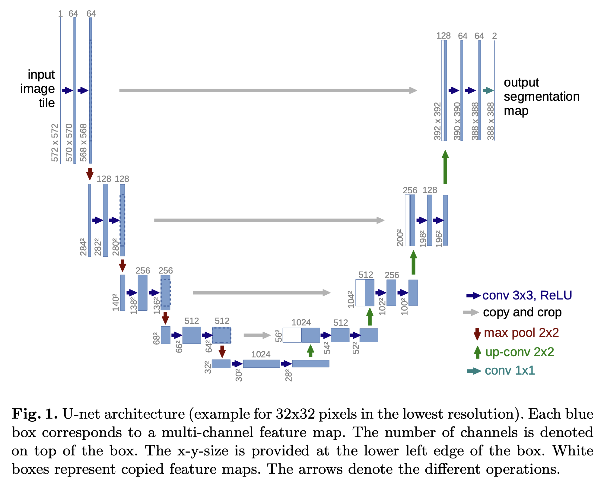

I'll walk you through building the U-Net architecture step by step, matching the original paper's diagram you shared.


## Understanding the Diagram First

{#fig-unet-original width="100%"}


```
Original Paper Dimensions (Valid Convolutions - no padding):

INPUT: 572×572×1
         │
    ┌────┴────┐
    │ 64  64  │ 572→570→568    ─────────────────────────┐
    └────┬────┘                   (copy & crop)         │
         │ MaxPool 2×2                                  │
    ┌────┴────┐                                         │
    │128  128 │ 284→282→280    ─────────────────────┐   │
    └────┬────┘                   (copy & crop)     │   │
         │ MaxPool 2×2                              │   │
    ┌────┴────┐                                     │   │
    │256  256 │ 140→138→136    ─────────────────┐   │   │
    └────┬────┘                   (copy & crop) │   │   │
         │ MaxPool 2×2                          │   │   │
    ┌────┴────┐                                 │   │   │
    │512  512 │ 68→66→64       ─────────────┐   │   │   │
    └────┬────┘                (copy & crop)│   │   │   │
         │ MaxPool 2×2                      │   │   │   │
    ┌────┴────┐                             │   │   │   │
    │1024 1024│ 32→30→28  (Bottleneck)      │   │   │   │
    └────┬────┘                             │   │   │   │
         │ UpConv 2×2                       │   │   │   │
    ┌────┴────┐                             │   │   │   │
    │512  512 │ 56→54→52  ◀─────────────────┘   │   │   │
    └────┬────┘    concat                       │   │   │
         │ UpConv 2×2                           │   │   │
    ┌────┴────┐                                 │   │   │
    │256  256 │ 104→102→100  ◀──────────────────┘   │   │
    └────┬────┘    concat                           │   │
         │ UpConv 2×2                               │   │
    ┌────┴────┐                                     │   │
    │128  128 │ 200→198→196  ◀──────────────────────┘   │
    └────┬────┘    concat                               │
         │ UpConv 2×2                                   │
    ┌────┴────┐                                         │
    │ 64  64  │ 392→390→388  ◀──────────────────────────┘
    └────┬────┘    concat
         │ Conv 1×1
         ▼
OUTPUT: 388×388×2 (2 classes)
```


## PyTorch Implementation

Let me create a complete, well-documented implementation:Here's the complete U-Net implementation. Let me explain the key components:

```python
import torch
import torch.nn as nn
import torch.nn.functional as F
```

## Component Breakdown


### 1. DoubleConv — The Basic Building Block

```
    Input
      │
      ▼
┌───────────┐
│ Conv 3×3  │  kernel=3, padding=1, no bias
│ BatchNorm │  (not in original, but standard now)
│ ReLU      │
└─────┬─────┘
      │
      ▼
┌───────────┐
│ Conv 3×3  │
│ BatchNorm │
│ ReLU      │
└─────┬─────┘
      │
      ▼
   Output
```

Every blue box pair in your diagram represents this DoubleConv block.

**Original paper uses:** 

```
Conv3x3 (no padding) -> ReLU -> Conv3x3 (no padding) -> ReLU
``` 

**Modern implementation (used here):** 

```
Conv3x3 (padding=1) -> BatchNorm -> ReLU -> Conv3x3 (padding=1) -> BatchNorm -> ReLU
```

**Why padding=1?**

- Original paper: no padding → output shrinks by 2 pixels per conv
- Modern approach: padding=1 → output size = input size (easier to handle)

**Why BatchNorm?**

- Not in original paper, but standard practice now
- Stabilizes training, allows higher learning rates


::: {.callout-note appearance="simple" collapse="true"}
#### Code: `DoubleConv`

```python
# =============================================================================
# Building Block 1: Double Convolution
# =============================================================================
class DoubleConv(nn.Module):
    """
    Double Convolution Block: (Conv3x3 -> BN -> ReLU) × 2

    This is the basic building block used throughout U-Net.
    Each encoder and decoder level uses this block.
    """

    def __init__(self, in_channels: int, out_channels: int):
        super().__init__()

        self.double_conv = nn.Sequential(
            # First convolution
            nn.Conv2d(
                in_channels,
                out_channels,
                kernel_size=3,
                padding=1,  # Same padding: output size = input size
                bias=False,  # No bias needed when using BatchNorm
            ),
            nn.BatchNorm2d(out_channels),
            nn.ReLU(inplace=True),
            # Second convolution
            nn.Conv2d(out_channels, out_channels, kernel_size=3, padding=1, bias=False),
            nn.BatchNorm2d(out_channels),
            nn.ReLU(inplace=True),
        )

    def forward(self, x: torch.Tensor) -> torch.Tensor:
        return self.double_conv(x)
```


:::


### 2. EncoderBlock — Down-sampling

```
    Input: H × W × C
           │
    ┌──────▼──────┐
    │ MaxPool 2×2 │  ← Red arrow in diagram
    └──────┬──────┘
           │
           ▼
      H/2 × W/2 × C
           │
    ┌──────▼──────┐
    │ DoubleConv  │  ← Blue arrows in diagram
    └──────┬──────┘
           │
           ▼
    H/2 × W/2 × 2C   (channels double)
```

::: {.callout-note appearance="simple" collapse="true"}
#### Code: `EncoderBlock`

```python
# =============================================================================
# Building Block 2: Encoder Block (Down-sampling)
# =============================================================================
class EncoderBlock(nn.Module):
    """
    Encoder Block: MaxPool -> DoubleConv

    This block:
    1. Reduces spatial dimensions by 2 (MaxPool 2×2)
    2. Applies double convolution to extract features

    Diagram:
    --------
        Input: H × W × C_in
              │
              ▼
        ┌─────────────┐
        │ MaxPool 2×2 │  Reduces: H×W → H/2 × W/2
        └──────┬──────┘
               │
               ▼
        ┌─────────────┐
        │ DoubleConv  │  Changes channels: C_in → C_out
        └──────┬──────┘
               │
               ▼
        Output: H/2 × W/2 × C_out

    Example (from paper diagram, Level 1→2):
        Input:  568 × 568 × 64
        After MaxPool: 284 × 284 × 64
        After DoubleConv: 284 × 284 × 128  (with modern padding)
    """

    def __init__(self, in_channels: int, out_channels: int):
        super().__init__()

        self.encoder = nn.Sequential(
            nn.MaxPool2d(kernel_size=2, stride=2),  # Halve spatial dimensions
            DoubleConv(in_channels, out_channels),  # Process features
        )

    def forward(self, x: torch.Tensor) -> torch.Tensor:
        return self.encoder(x)
```

:::


### 3. DecoderBlock — Up-sampling + Skip Connection


```
Decoder Block: UpConv -> Concatenate Skip -> DoubleConv
```

This block:

1. Upsamples feature map by 2 (transposed conv or bilinear)
2. Concatenates with skip connection from encoder
3. Applies double convolution

```
        Input from below          Skip from encoder
        (H × W × C_in)            (2H × 2W × C_skip)
              │                          │
              ▼                          │
        ┌─────────────┐                  │
        │ UpConv 2×2  │ → 2H × 2W × C_in/2
        └──────┬──────┘                  │
               │                         │
               └────────┬────────────────┘
                        │ Concatenate along channel dim
                        ▼
                  2H × 2W × (C_in/2 + C_skip)
                        │
                        ▼
                 ┌─────────────┐
                 │ DoubleConv  │
                 └──────┬──────┘
                        │
                        ▼
                  2H × 2W × C_out
```

Two upsampling methods:

1. **Transposed Convolution** (`ConvTranspose2d`):
  - Learnable upsampling
  - Can produce checkerboard artifacts
  - Used in original paper

2. **Bilinear Interpolation** + **Conv**:
  - Fixed upsampling + learnable conv
  - Smoother results, no checkerboard
  - Often preferred in practice

::: {.callout-note appearance="simple" collapse="true"}
#### Code: `DecoderBlock`

```python
# =============================================================================
# Building Block 3: Decoder Block (Up-sampling)
# =============================================================================
class DecoderBlock(nn.Module):
    """
    Decoder Block: UpConv -> Concatenate Skip -> DoubleConv

    This block:
    1. Upsamples feature map by 2 (transposed conv or bilinear)
    2. Concatenates with skip connection from encoder
    3. Applies double convolution
    """

    def __init__(self, in_channels: int, out_channels: int, bilinear: bool = False):
        super().__init__()

        if bilinear:
            # Bilinear upsampling followed by convolution
            self.up = nn.Sequential(
                nn.Upsample(scale_factor=2, mode="bilinear", align_corners=True),
                nn.Conv2d(in_channels, in_channels // 2, kernel_size=1),
            )
        else:
            # Transposed convolution (original paper approach)
            # This learns how to upsample
            self.up = nn.ConvTranspose2d(
                in_channels, in_channels // 2, kernel_size=2, stride=2
            )

        # After concatenation: (in_channels // 2) + (in_channels // 2) = in_channels
        self.conv = DoubleConv(in_channels, out_channels)

    def forward(self, x: torch.Tensor, skip: torch.Tensor) -> torch.Tensor:
        """
        Args:
            x: Feature map from previous decoder level (smaller)
            skip: Feature map from encoder (skip connection)
        """
        # Step 1: Upsample x to match skip connection size
        x = self.up(x)

        # Step 2: Handle size mismatch (if any)
        # This can happen due to odd input sizes or when not using padding
        diff_H = skip.size(2) - x.size(2)
        diff_W = skip.size(3) - x.size(3)

        # Pad x to match skip size (center crop equivalent)
        x = F.pad(
            x, [diff_W // 2, diff_W - diff_W // 2, diff_H // 2, diff_H - diff_H // 2]
        )

        # Step 3: Concatenate along channel dimension
        # x: [B, C, H, W] + skip: [B, C, H, W] → [B, 2C, H, W]
        x = torch.cat([skip, x], dim=1)

        # Step 4: Apply double convolution
        return self.conv(x)
```

:::

### 4. Channel Progression (Matching Your Diagram)

```
Layer        Channels    Spatial Size (with padding=1)
─────────────────────────────────────────────────────
Input        1           256 × 256
enc1         64          256 × 256
enc2         128         128 × 128
enc3         256         64 × 64
enc4         512         32 × 32
bottleneck   1024        16 × 16      ← Deepest point
dec4         512         32 × 32
dec3         256         64 × 64
dec2         128         128 × 128
dec1         64          256 × 256
Output       2           256 × 256    ← Same as input!
```

### Complete Model

::: {.callout-note appearance="simple" collapse="true"}
#### U-Net


```python
# =============================================================================
# Complete U-Net Model
# =============================================================================
class UNet(nn.Module):
    """
    Complete U-Net Architecture

    Default configuration matches original paper:
    - Input: any size (will work with various sizes due to padding)
    - Channels: 64 → 128 → 256 → 512 → 1024 → 512 → 256 → 128 → 64
    - Output: same spatial size as input (with padding=1)

    Channel flow through the network:
    ---------------------------------

    ENCODER:                           DECODER:

    in_ch → 64  (enc1) ──────────────▶ 64 → out_ch (final)
                │                           ▲
                ▼                           │
    64 → 128    (enc2) ──────────────▶ 128  (dec1)
                │                           ▲
                ▼                           │
    128 → 256   (enc3) ──────────────▶ 256  (dec2)
                │                           ▲
                ▼                           │
    256 → 512   (enc4) ──────────────▶ 512  (dec3)
                │                           ▲
                ▼                           │
                └──▶ 512 → 1024 (bottleneck) ──▶ (dec4)

    Args:
        in_channels: Number of input channels (1 for grayscale, 3 for RGB)
        out_channels: Number of output classes (2 for binary segmentation)
        features: Base number of features (default 64, doubles each level)
        bilinear: Use bilinear upsampling instead of transposed conv
    """

    def __init__(
        self,
        in_channels: int = 1,  # Grayscale medical images
        out_channels: int = 2,  # Binary segmentation (background + foreground)
        features: int = 64,  # Base feature channels
        bilinear: bool = False,  # Upsampling method
    ):
        super().__init__()

        self.in_channels = in_channels
        self.out_channels = out_channels

        # ==== ENCODER (Contracting Path) ====

        # Initial convolution (no pooling)
        # Input: [B, in_channels, H, W] → Output: [B, 64, H, W]
        self.enc1 = DoubleConv(in_channels, features)  # 1 → 64

        # Encoder blocks (pool + conv)
        self.enc2 = EncoderBlock(features, features * 2)  # 64 → 128
        self.enc3 = EncoderBlock(features * 2, features * 4)  # 128 → 256
        self.enc4 = EncoderBlock(features * 4, features * 8)  # 256 → 512

        # ==== BOTTLENECK ====
        # Deepest part of the U
        # Input: [B, 512, H/16, W/16] → Output: [B, 1024, H/16, W/16]
        self.bottleneck = EncoderBlock(features * 8, features * 16)  # 512 → 1024

        # ==== DECODER (Expanding Path) ====

        # Decoder blocks (upsample + concat + conv)
        self.dec4 = DecoderBlock(features * 16, features * 8, bilinear)  # 1024 → 512
        self.dec3 = DecoderBlock(features * 8, features * 4, bilinear)  # 512 → 256
        self.dec2 = DecoderBlock(features * 4, features * 2, bilinear)  # 256 → 128
        self.dec1 = DecoderBlock(features * 2, features, bilinear)  # 128 → 64

        # ==== FINAL OUTPUT ====
        # 1x1 convolution to map features to class predictions
        # Input: [B, 64, H, W] → Output: [B, out_channels, H, W]
        self.final_conv = nn.Conv2d(features, out_channels, kernel_size=1)

    def forward(self, x: torch.Tensor) -> torch.Tensor:
        """
        Forward pass through U-Net

        Args:
            x: Input tensor of shape [B, C, H, W]
               B = batch size
               C = input channels (1 for grayscale)
               H, W = height and width (should be divisible by 16)

        Returns:
            Output tensor of shape [B, num_classes, H, W]
            Raw logits (apply softmax/sigmoid for probabilities)
        """

        # ============ ENCODER ============
        # Each level: extract features + save for skip connection

        # Level 1: Full resolution
        skip1 = self.enc1(x)  # [B, 64, H, W]

        # Level 2: 1/2 resolution
        skip2 = self.enc2(skip1)  # [B, 128, H/2, W/2]

        # Level 3: 1/4 resolution
        skip3 = self.enc3(skip2)  # [B, 256, H/4, W/4]

        # Level 4: 1/8 resolution
        skip4 = self.enc4(skip3)  # [B, 512, H/8, W/8]

        # ============ BOTTLENECK ============
        # Deepest level: 1/16 resolution
        bottleneck = self.bottleneck(skip4)  # [B, 1024, H/16, W/16]

        # ============ DECODER ============
        # Each level: upsample + concatenate skip + conv

        # Level 4: 1/8 resolution
        d4 = self.dec4(bottleneck, skip4)  # [B, 512, H/8, W/8]

        # Level 3: 1/4 resolution
        d3 = self.dec3(d4, skip3)  # [B, 256, H/4, W/4]

        # Level 2: 1/2 resolution
        d2 = self.dec2(d3, skip2)  # [B, 128, H/2, W/2]

        # Level 1: Full resolution
        d1 = self.dec1(d2, skip1)  # [B, 64, H, W]

        # ============ OUTPUT ============
        # 1x1 conv to get class predictions
        out = self.final_conv(d1)  # [B, num_classes, H, W]

        return out

```

:::

::: {.callout-note appearance="simple" collapse="true"}
#### Utils & Main Functions

```python
# =============================================================================
# Utility Functions
# =============================================================================


def count_parameters(model: nn.Module) -> int:
    """Count the number of trainable parameters in a model."""
    return sum(p.numel() for p in model.parameters() if p.requires_grad)


def test_unet():
    """Test U-Net with sample input to verify architecture."""

    # Configuration
    batch_size = 2
    in_channels = 1  # Grayscale (CT/MRI)
    out_channels = 2  # Binary segmentation
    height, width = 256, 256  # Should be divisible by 16

    # Create model
    model = UNet(
        in_channels=in_channels, out_channels=out_channels, features=64, bilinear=False
    )

    # Create dummy input
    x = torch.randn(batch_size, in_channels, height, width)

    # Forward pass
    with torch.no_grad():
        output = model(x)

    # Print info
    print("=" * 60)
    print("U-Net Architecture Test")
    print("=" * 60)
    print(f"Input shape:  {x.shape}")
    print(f"Output shape: {output.shape}")
    print(f"Total parameters: {count_parameters(model):,}")
    print("=" * 60)

    # Verify shapes
    assert output.shape == (batch_size, out_channels, height, width), (
        f"Output shape mismatch! Expected {(batch_size, out_channels, height, width)}"
    )

    print("✓ All tests passed!")

    return model


# =============================================================================
# Main
# =============================================================================

if __name__ == "__main__":
    model = test_unet()

    # Print model summary
    print("\nModel Architecture:")
    print(model)
```

:::


## Original Paper vs Modern Implementation

| Aspect | Original Paper | This Implementation |
|--------|----------------|---------------------|
| Padding | None (valid conv) | padding=1 (same conv) |
| Output size | Smaller than input | Same as input |
| Skip connection | Crop to match | Pad to match |
| Normalization | None | BatchNorm |
| Upsampling | TransposedConv | TransposedConv (or bilinear) |


## How to Use

```python
import torch
from unet import UNet

# Create model for binary segmentation of CT scans
model = UNet(
    in_channels=1,    # Grayscale CT
    out_channels=2,   # Background + Lesion
    features=64       # Base channels
)

# Input: batch of 4 CT slices, 256×256
x = torch.randn(4, 1, 256, 256)

# Forward pass
logits = model(x)  # Shape: [4, 2, 256, 256]

# Get predictions
predictions = torch.argmax(logits, dim=1)  # Shape: [4, 256, 256]
```
